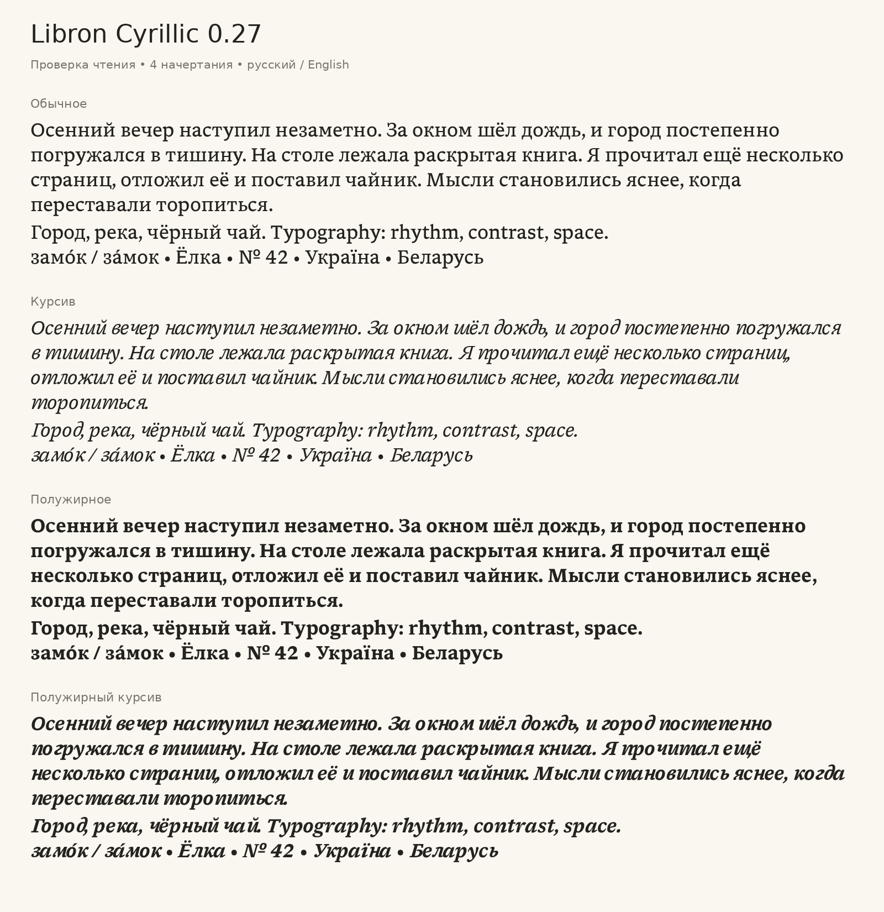

# Libron Cyrillic

An unofficial Cyrillic adaptation of [Libron](https://github.com/nicoverbruggen/libron)
0.25, published as a fork by [quniob](https://github.com/quniob). Matching letterforms
reuse Libron's own outlines; distinct Cyrillic forms are adapted from
[Literata](https://github.com/googlefonts/literata) to fit Libron's height, width,
stroke weight, spacing and italic slant.

[Русская документация](README-RU.md) · [Download the complete package](dist/Libron-Cyrillic-0.26.zip)



## Install

Install the four files in [fonts/ttf](fonts/ttf). The font family appears as
**Libron Cyrillic** and includes Regular, Italic, Bold and Bold Italic.
It can coexist with the original Libron.

- Windows: select the TTF files, right-click and choose **Install**.
- macOS: open the TTF files in **Font Book** and choose **Install**.
- Linux: copy them to `~/.local/share/fonts/LibronCyrillic/`, then run `fc-cache -f`.
- Reading apps: import all four TTF files through the app's font settings.

## Coverage

- 100 added characters: U+0400–U+045F, Ґ/ґ and Ѣ/ѣ.
- Full Russian alphabet, including Ё/ё, plus Ukrainian and Belarusian characters.
- Cyrillic kerning, mixed Latin/Cyrillic text and combining acute U+0301: за́мок, замо́к.
- Synthetic Cyrillic small caps through `smcp` and `c2sc`, following upstream Libron.
- Original Latin, digits, punctuation and the № sign retained.

This covers the basic Cyrillic block rather than every Cyrillic Extended range.
Dedicated Bulgarian and Serbian localized `locl` forms were not designed.
The adaptation has not received a professional node-by-node type-design review
or been tested on a physical E Ink device.

## Preview and webfonts

Open [preview.html](preview.html) locally to try your own text, sizes, styles and
small caps. It does not send text anywhere. If the browser blocks local fonts,
install the TTF files or serve the repository with `python3 -m http.server 8000`.

Use the four [WOFF2 fonts](fonts/web) with the included CSS:

```html
<link rel="stylesheet" href="fonts/web/libron-cyrillic.css">
```

```css
body { font-family: "Libron Cyrillic", serif; }
```

## Build

The repository includes the edited FontForge masters in `src/`, the unmodified
Libron inputs in `cyrillic/base/`, fixed Literata instances and the transformation
parameters in `cyrillic/config.json`. See [provenance](cyrillic/PROVENANCE.json)
for the exact source commits and instance parameters.

Build the committed SFD masters using upstream's builder image:

```bash
podman run --rm -v "$PWD":/work -w /work \
  ghcr.io/nicoverbruggen/fntbld-oci:latest python3 build.py
```

To regenerate the Cyrillic masters first:

```bash
podman run --rm -v "$PWD":/work -w /work \
  ghcr.io/nicoverbruggen/fntbld-oci:latest python3 scripts/add_cyrillic.py
```

The build exports `out/ttf/` and `out/web/`. `build.py --with-kobofix` additionally
creates Kobo variants; the committed downloadable package contains standard TTF
and WOFF2 files.

## Validation

All four TTF files pass OpenType Sanitizer. The shaping checks cover Unicode
coverage, visible outlines, vertical clipping, style linking, kerning, combining
acute placement, small caps and TTF/WOFF2 character-map parity using HarfBuzz.
The latest results are in [fonts/validation.json](fonts/validation.json).

```bash
python3 scripts/validate_cyrillic.py
```

Run the check inside the builder image or an environment with FontTools, Brotli
and the HarfBuzz shared library. CI rebuilds and validates the fonts.

## License and attribution

The font software remains under the **SIL Open Font License 1.1**. See [LICENSE](LICENSE),
[COPYRIGHT](COPYRIGHT) and [Literata's license](cyrillic/OFL-Literata.txt).
Upstream authors are credited for their work; this fork does not imply their
endorsement.

- [Newsreader](https://github.com/productiontype/Newsreader): the Newsreader Project Authors.
- [Readerly](https://github.com/nicoverbruggen/readerly) and
  [Libron](https://github.com/nicoverbruggen/libron): Nico Verbruggen.
- [Literata](https://github.com/googlefonts/literata): the Literata Project Authors.
